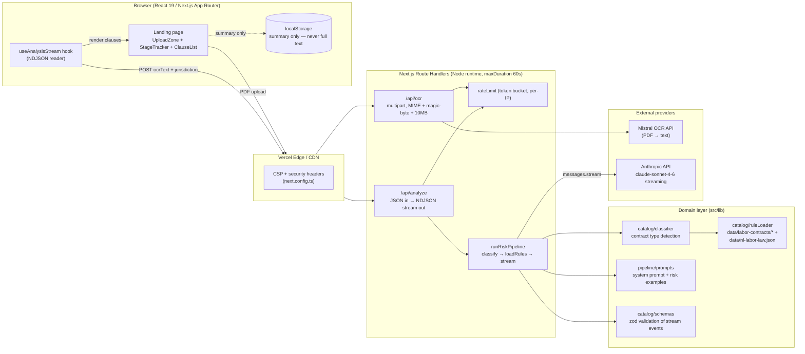
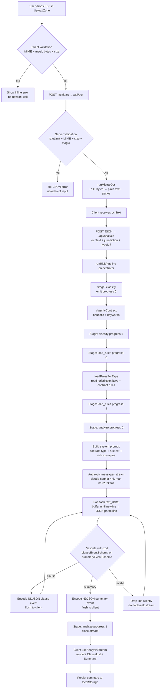
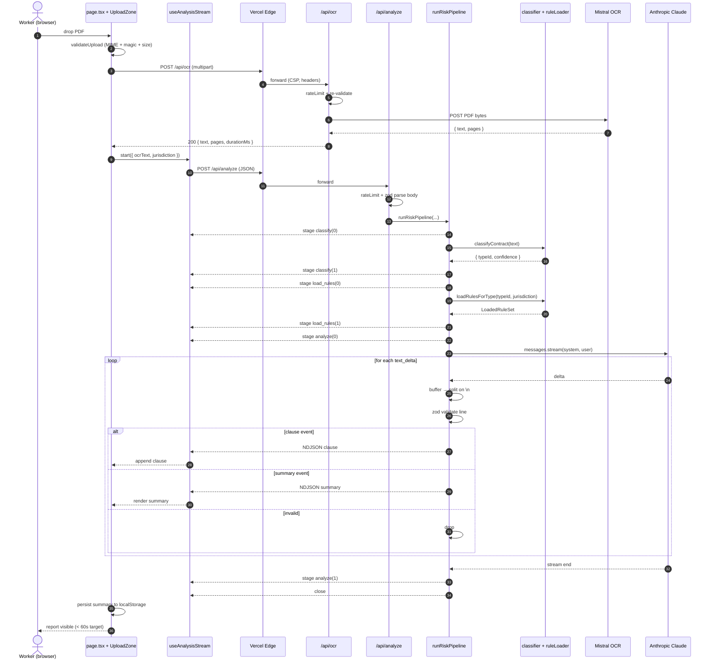

# System Design — contractact-u-ally

All diagrams are Mermaid (renders in GitHub / Markdown viewers).
Source of truth for the C4 model can later move to a Structurizr DSL workspace.

---

## 1. High-level (C4 Container)

**Key constraints**

- No database. No persistence of contract content. `localStorage` holds only
  the rendered summary so a refresh keeps results.
- Provider keys (`MISTRAL_API_KEY`, `ANTHROPIC_API_KEY`) are server-only.
- Both routes are rate-limited (5 req / 60s per IP, token bucket).

---

## 2. Processing algorithm (how a contract is analyzed)

**Why streaming end-to-end**

- Worker sees clauses appear as soon as Claude emits them — perceived latency
  matters more than total wall clock.
- NDJSON (one JSON object per line) is trivially parseable in the browser
  without a streaming JSON parser.
- zod validation per-line means a corrupted line cannot poison the UI; it is
  dropped, the next line still renders.

**Failure modes**
| Stage | Failure | Behavior |
|---|---|---|
| Upload | Wrong MIME / oversized | 4xx JSON, never echo filename |
| OCR | Mistral 5xx / timeout | 5xx surfaced to client, no retry-storm |
| Classify | Unknown contract type | Falls back to generic ruleset |
| Stream | Anthropic disconnect | Stream closes; partial clauses remain rendered |
| Validation | Malformed JSON line | Line dropped, stream continues |

---

## 3. Request path — sequence diagram

---

## 4. Notes for the next iteration

- **C4 layers not yet drawn:** Component diagram for `src/lib/catalog/*` and a
  Deployment diagram (Vercel Functions + provider regions).
- **Observability:** add structured server logs (no PII) — request id, stage,
  duration, provider latency. Stream events already include progress markers
  that can double as client-side timing breadcrumbs.
- **Resilience:** wrap Anthropic call in a single retry on transient network
  errors only — never on 4xx. Today the pipeline relies on the client to
  retry the whole `/api/analyze` call.
- **Caching:** OCR text for identical PDF hashes could be cached per session
  in memory only (no disk). Out of scope until the rule engine stabilizes.
