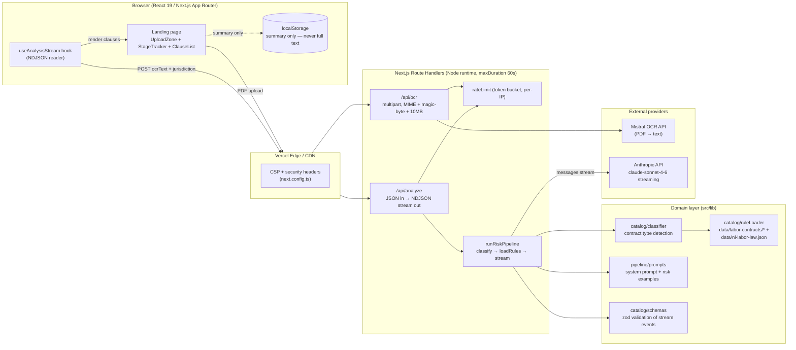

# System Design — contractact-u-ally

All diagrams are Mermaid (renders in GitHub / Markdown viewers).
Source of truth for the C4 model can later move to a Structurizr DSL workspace.

---

## 1. High-level (C4 Container)

**Key constraints**

- No database. No persistence of contract content. `localStorage` holds only
  the rendered summary so a refresh keeps results.
- Provider keys (`MISTRAL_API_KEY`, `ANTHROPIC_API_KEY`) are server-only.
- Both routes are rate-limited (5 req / 60s per IP, token bucket).
