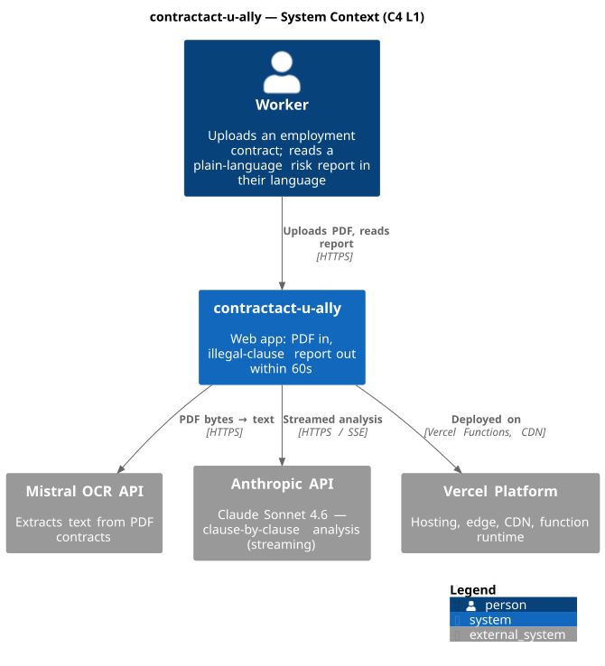

# System Design — contractact-u-ally

This document describes the runtime architecture of the app using the C4 model
for structure (Context, Container, Component) and D2 for the request-path
sequence and the processing-algorithm flow. Sources for every diagram live
next to this file under `docs/diagrams/src/`; rendered SVGs under
`docs/diagrams/img/`.

Re-render after any edit:

```bash
plantuml -tsvg -o ../img \
  docs/diagrams/src/c4-context.puml \
  docs/diagrams/src/c4-container.puml \
  docs/diagrams/src/c4-component-pipeline.puml

d2 docs/diagrams/src/algorithm-pipeline.d2  docs/diagrams/img/algorithm-pipeline.svg
d2 docs/diagrams/src/sequence-request-path.d2 docs/diagrams/img/sequence-request-path.svg
```

---

## 1. C4 L1 — System Context



The product has one human user (the **Worker**) and one system under our
control (**contractact-u-ally**). Three external systems are load-bearing:

- **Mistral OCR API** turns the uploaded PDF into plain text.
- **Anthropic API** (Claude Sonnet 4.6) does the clause-by-clause legal
  analysis and streams results back token-by-token.
- **Vercel** hosts the app — Edge for static + headers, Functions for the
  API routes, CDN for assets.

There is no database. Nothing about the contract is persisted server-side.

---

## 2. C4 L2 — Containers


Inside our system boundary:

- **Web UI** (`src/app/page.tsx`, `src/components/**`) — the landing page,
  upload zone, stage tracker and clause list. The `useAnalysisStream` hook
  reads the NDJSON stream and incrementally renders clauses.
- **Browser localStorage** stores **only the rendered summary** so a refresh
  preserves results. The full contract text is never written to it.
- **`/api/ocr`** (`src/app/api/ocr/route.ts`) — multipart endpoint. Validates
  MIME type, magic bytes and size (≤10MB), then proxies to Mistral.
- **`/api/analyze`** (`src/app/api/analyze/route.ts`) — JSON in, NDJSON
  stream out. Drives `runRiskPipeline`.
- **runRiskPipeline** (`src/lib/pipeline/runRiskPipeline.ts`) — server-only
  orchestrator. Owns the `ReadableStream` returned to the client.
- **Rule Catalog** (`src/lib/catalog/*`) — classifier, rule loader, zod
  schemas. Reads `data/labor-contracts/*` and `data/nl-labor-law.json`.
- **rateLimit** (`src/lib/rateLimit.ts`) — per-IP token bucket (5 / 60s)
  applied to both API routes.

Provider keys (`MISTRAL_API_KEY`, `ANTHROPIC_API_KEY`) are read only inside
the server modules; nothing in this layer ships to the client bundle.
