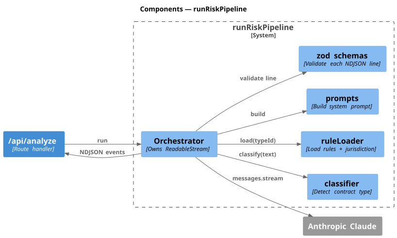
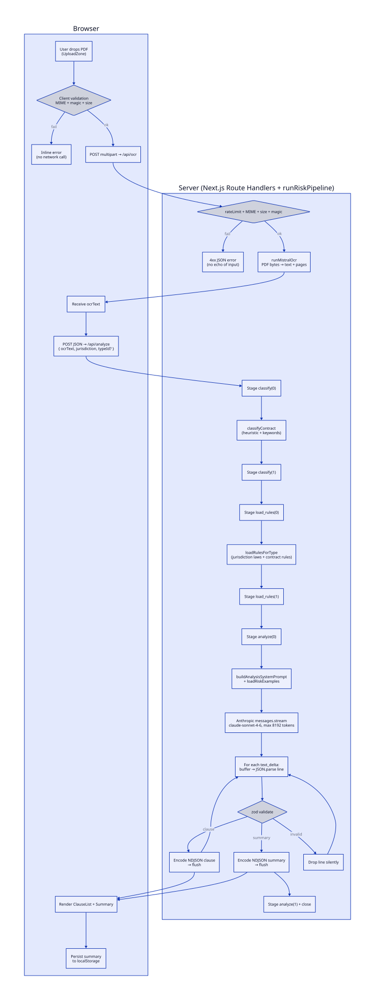
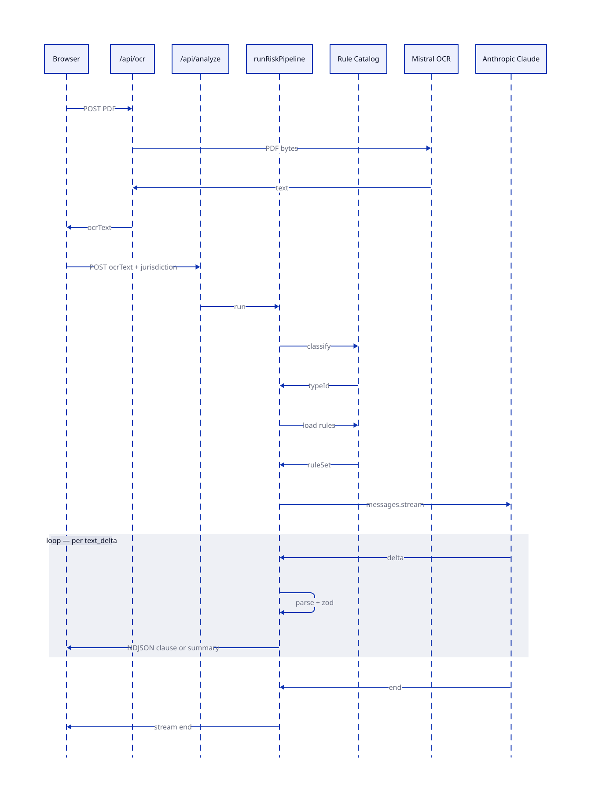

# System Design

C4 for structure, D2 for the dynamic views. Sources in
`docs/diagrams/src/`, rendered SVGs in `docs/diagrams/img/`.

Re-render:

```bash
plantuml -tsvg -o ../img docs/diagrams/src/*.puml
d2 docs/diagrams/src/algorithm-pipeline.d2  docs/diagrams/img/algorithm-pipeline.svg
d2 docs/diagrams/src/sequence-request-path.d2 docs/diagrams/img/sequence-request-path.svg
```

---

## Context


A worker uploads a PDF and reads a risk report. Two external services do the
heavy lifting: **Mistral** for OCR, **Anthropic Claude** for the streamed
clause analysis. No database.

## Containers


- **Web UI** drives the upload and renders the streamed report.
- **`/api/ocr`** validates the upload and proxies to Mistral.
- **`/api/analyze`** runs the pipeline and streams NDJSON back.
- **runRiskPipeline** orchestrates classify → load rules → Claude stream.
- **Rule Catalog** holds the rules and the zod schemas used to validate every
  streamed line.

Provider keys live only on the server. Both API routes are rate-limited.

## Pipeline components



Inside `runRiskPipeline`:

- **Orchestrator** owns the response stream and the stage progress events.
- **classifier** picks the contract type from the OCR text.
- **ruleLoader** loads the rule set for that type and jurisdiction.
- **prompts** builds the system prompt from the rules + risk examples.
- **zod schemas** validate every JSON line emitted by Claude; bad lines are
  dropped, the stream survives.

---

## Algorithm



`Upload → OCR → Classify → Load rules → Build prompt → Claude stream`. Every
line Claude emits is zod-validated; valid lines flush as NDJSON, invalid
lines are dropped. The summary line ends the stream.

| Stage      | Failure                | Behavior                              |
| ---------- | ---------------------- | ------------------------------------- |
| Upload     | Wrong MIME / oversized | 4xx JSON, no echo of input            |
| OCR        | Mistral 5xx / timeout  | 5xx surfaced, no retry-storm          |
| Classify   | Unknown type           | Falls back to a generic ruleset       |
| Stream     | Anthropic disconnect   | Stream closes; partial output remains |
| Validation | Malformed line         | Dropped, stream continues             |

## Request path



One full session: PDF upload → OCR → analyze request → stage events →
streamed clauses → summary → close.

---

## Next

- C4 L4 deployment view (Vercel Functions + provider regions).
- One-shot retry on transient Anthropic errors.
- Structured server logs (no PII): request id, stage, duration.
