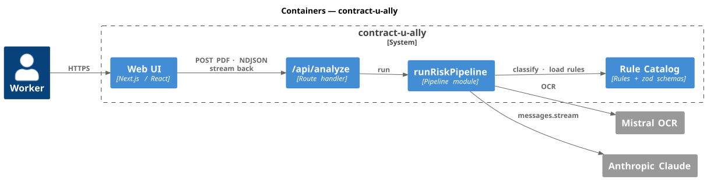
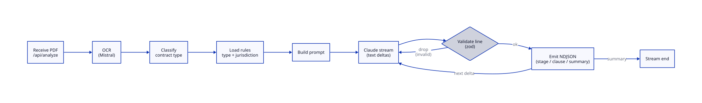
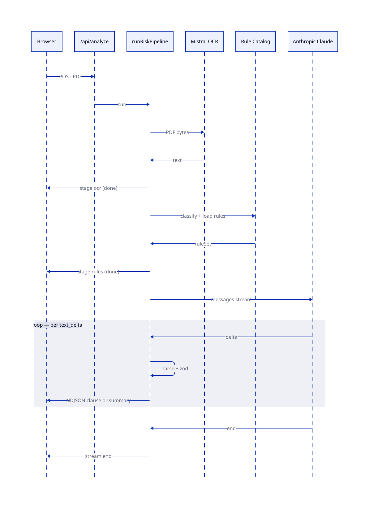

# System Design

C4 for structure, D2 for the dynamic views. Sources in
`docs/diagrams/src/`, rendered SVGs in `docs/diagrams/img/`.

Re-render:

```bash
plantuml -tsvg -o ../img docs/diagrams/src/c4-container.puml
d2 docs/diagrams/src/algorithm.d2 docs/diagrams/img/algorithm.svg
d2 docs/diagrams/src/sequence.d2  docs/diagrams/img/sequence.svg
```

---

## Containers



The browser makes **one** request: it posts the PDF to `/api/analyze` and
receives an NDJSON stream back. OCR is internal — the PDF never leaves the
server boundary as something the client has to round-trip on.

- **Web UI** drives the upload and renders the streamed report.
- **`/api/analyze`** is the only endpoint the browser talks to. It hands the
  PDF to the pipeline and pipes the pipeline's NDJSON events back.
- **runRiskPipeline** orchestrates OCR → classify → load rules → Claude
  stream, emitting stage / clause / summary events along the way.
- **Rule Catalog** holds the rules and the zod schemas used to validate every
  streamed line.

Provider keys live only on the server. The route is rate-limited.

---

## Algorithm



`Receive PDF → OCR → Classify → Load rules → Build prompt → Claude stream`.
Every line Claude emits is zod-validated; valid lines flush as NDJSON,
invalid lines are dropped. The summary line ends the stream.

| Stage      | Failure                | Behavior                              |
| ---------- | ---------------------- | ------------------------------------- |
| Upload     | Wrong MIME / oversized | 4xx JSON, no echo of input            |
| OCR        | Mistral 5xx / timeout  | 5xx surfaced, no retry-storm          |
| Classify   | Unknown type           | Falls back to a generic ruleset       |
| Stream     | Anthropic disconnect   | Stream closes; partial output remains |
| Validation | Malformed line         | Dropped, stream continues             |

---

## Request path



One trip: the browser posts the PDF and keeps the connection open. The
server runs OCR (Mistral), classifies, loads rules, then opens a Claude
stream. Status events (`stage ocr`, `stage rules`) and content events
(`clause`, `summary`) all flow back over the same response until the stream
closes.

---

## Next

- One-shot retry on transient Anthropic errors.
- Structured server logs (no PII): request id, stage, duration.
